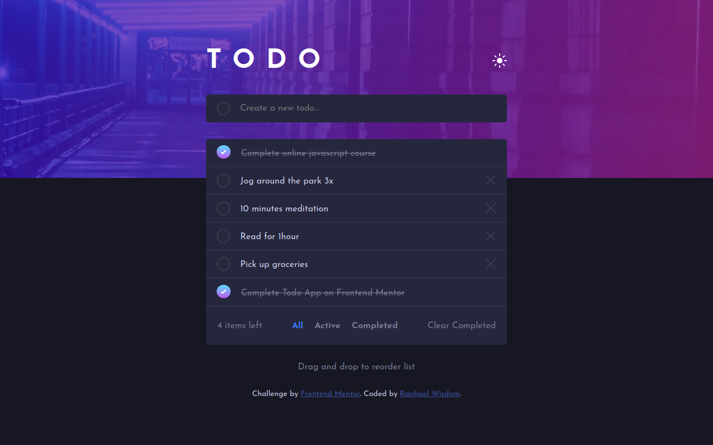

# Frontend Mentor - Todo app solution

This is a solution to the [Todo app challenge on Frontend Mentor](https://www.frontendmentor.io/challenges/todo-app-Su1_KokOW). Frontend Mentor challenges help you improve your coding skills by building realistic projects.

## Table of contents

- [Frontend Mentor - Todo app solution](#frontend-mentor---todo-app-solution)
  - [Table of contents](#table-of-contents)
  - [Overview](#overview)
    - [The challenge](#the-challenge)
    - [Screenshot](#screenshot)
    - [Links](#links)
  - [My process](#my-process)
    - [Built with](#built-with)
    - [What I learned](#what-i-learned)
    - [Continued development](#continued-development)
    - [Useful resources](#useful-resources)
  - [Author](#author)
  - [Acknowledgments](#acknowledgments)

## Overview

### The challenge

Users should be able to:

- View the optimal layout for the app depending on their device's screen size
- See hover states for all interactive elements on the page
- Add new todos to the list
- Mark todos as complete
- Delete todos from the list
- Filter by all/active/complete todos
- Clear all completed todos
- Toggle light and dark mode
- **Bonus**: Drag and drop to reorder items on the list

### Screenshot

### Links

- Solution URL: [solution URL](https://www.frontendmentor.io/challenges/todo-app-Su1_KokOW/hub)
- Live Site URL: [Vercel](https://frontend-mentor-challenge-todo-app.vercel.app/)

## My process

### Built with

- Semantic HTML5 markup
- CSS custom properties
- Flexbox
- [React](https://reactjs.org/) - JS library
- VITE
- Desktop-first workflow

### What I learned

Working on this project has taught me and helped me practice how to work with Context API and creating and using custom hooks.

### Continued development

Still learning React and Redux, I would have love to store all the states using Modern Redux Toolkit and I think i would use it to store states in my first big project😊

### Useful resources

- [Code magic](https://code-magic.vercel.app/). It really helped me when i struggled to give the unchecked todo circle a gradient border color on hover state. It was a very helpful because i just had to input the different colors then it generated the css code which i used.

## Author

- Github - [Raphael Wisdom Chidera](https://github.com/Heisdera)
- Frontend Mentor - [@Heisdera](https://www.frontendmentor.io/profile/Heisdera)
- Twitter - [@Heisdera_Tech](https://twitter.com/Heisdera_Tech)

## Acknowledgments

A special thank you to myself for completing my second frontend mentor challenge😇.
